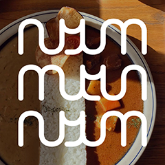

# nyum

*A simple Pandoc-powered static site generator for your recipe collection.*



This tool takes a **collection of Markdown-formatted recipes** and turns it into a **lightweight, responsive, searchable website** for your personal use as a reference while cooking, or for sharing with family and friends. It's *not* intended as a cooking blog framework – there's no RSS feed, no social sharing buttons, and absolutely zero SEO.

📓 Think of it as a **cookbook for nerds**.

Below the screenshots, you'll find some notes on [setting this tool up](#setup), [running it](#building), [formatting your recipes](#formatting), and [deploying the generated site](#deployment).


## Screenshots

If you prefer a live website over the following screenshots, feel free to **check out the [demo on GitHub Pages](https://doersino.github.io/nyum/_site/index.html)**!

On an old-fashioned computer, a [recipe](https://doersino.github.io/nyum/_site/cheesebuldak.html) might look more or less like this – notice the little star indicating that this is a favorite!


Below, on the right, is the same page shown at tablet scale. More interestingly, the index page is shown on the left (with an active search) – note that you can, of course, customize the title and description.


Finally, more of the same on three phone-sized screens. The three-column layout doesn't fit here, so instructions are shown below ingredients. And *of course* the light's turned off if you've enabled dark mode on your device.


## Usage

### Setup

First off, either `git clone` this repository or [download it as a ZIP](https://github.com/doersino/nyum/archive/refs/heads/main.zip). (You can clear out the `_recipes/` and `_site/` directories to get rid of the demo data.)

I don't like complicated dependency trees and poorly-documented build processes, so here's an **exhaustive list of the dependencies** you're not overwhelmingly likely to already have:

* [Pandoc](https://pandoc.org) – version 2.8 (released in November 2019) or later *(earlier versions don't support partials/subtemplates)*.

    On macOS, assuming you're using [Homebrew](https://brew.sh), `brew install pandoc` will do the trick. On Linux, your package manager almost certainly has it (although the version it provides might be outdated – recent binaries are available [here](https://github.com/jgm/pandoc/releases/latest)).

That's it, only one dependency! Hooray!

(Since `build.sh` relies on some Bash-specific bits and bobs and ubiquitous POSIX utilities like `awk` and `tee`, you'll also need those – but since Bash the default shell on most non-Windows systems, you're likely running it already. If you're a Windows user, don't despair: Through the magic of [WSL](https://docs.microsoft.com/en-us/windows/wsl/install-win10) and possibly [some Git or text editor reconfiguration to deal with line endings](https://github.com/doersino/nyum/issues/10), it's definitely possible to run this tool. If you run into trouble, feel free to [file an issue](https://github.com/doersino/nyum/issues), but know that I might be unable to offer much well-founded advice.)


### Configuration

Open `config.yaml` in whichever text editor you heart is drawn to in the moment and follow the instructions in the comments. There's not actually very much to configure.

You can, for example, change the language of your site. There's also a setting `show_images_on_index` (whose name obviates any need for further explanation).


### Building

Run `bash build.sh`.

(It accepts a few optional flags, notably `--help` which tells you about the rest of them.)


### Formatting

TL;DR: See the example recipes in `_recipes/`.

Each recipe **begins with YAML front matter specifying its title**, how many servings it produces, whether it's spicy or vegan or a favorite, the category, an image (which must also be located in the `_recipes/` directory), and other information. Scroll down a bit for a list of possible entries – most of these are optional!

The **body of a recipe consists of horizontal-rule-separated steps, each listing ingredients relevant in that step along with the associated instruction**. Ingredients are specified as an unordered list, with ingredient amounts enclosed in backticks (this enables the columns on the resulting website – if you don't care about that, omit the backticks). The instructions must be preceded with a `>`. Note that a step can also solely consist of an instruction.

*You've got the full power of Markdown at your disposal – douse your recipes in [formatting](https://github.com/doersino/nyum/blob/main/_recipes/kkaennipjeon.md), include a picture for each step, and use the garlic emoji as liberally as you should be using garlic in your cooking!*

<sub>(Before building this tool, I had been using a custom LaTeX template built on top of the [cuisine](https://ctan.org/pkg/cuisine?lang=en) package, which enforces a three-column, relevant-ingredients-next-to-instructions structure. [In the process of graduating from university, I found myself contemporaneously graduating from wanting to use LaTeX for everything, which was part of the impetus for building this tool.] I've found this structure to be more useful than the more commonly found all-ingredients-first-then-a-block-of-instructions approach.)</sub>


#### Example

```markdown
---
title: Cheese Buldak
original_title: 치즈불닭
category: Korean Food
description: Super-spicy chicken tempered with loads of cheese and fresh spring onions. Serve with rice and a light salad – or, better yet, an assortment of side dishes.
image: cheesebuldak.jpg
size: 2-3 servings
time: 1 hour
author: Maangchi
source: https://www.youtube.com/watch?v=T9uI1-6Ac6A
spicy: ✓
favorite: ✓
---

* `2 tbsp` chili flakes (gochugaru)
* `1 tbsp` gochujang
* `½-⅔ tbsp` soy sauce
* `1 tbsp` cooking oil
* `¼ tsp` pepper
* `2-3 tbsp` rice or corn syrup
* `2 tbsp` water

> Mix in an oven-proof saucepan or cast-iron skillet – you should end up with a thick marinade.

---

* `3-4 cloves` garlic
* `2 tsp` ginger

> Peel, squish with the side of your knife, then finely mince and add to the marinade.

---

> ⋯ (omitted for brevity)

---

> Garnish with the spring onion slices and serve.

```


#### YAML front matter

You *must* specify a non-empty value for the `title` entry. Everything else is optional:

* `original_title`: Name of the recipe in, say, its country of origin.
* `category`: Self-explanatory. Recipes belonging to the same category will be grouped on the index page. Don't name a category such that the generated category page will have the same URL as a recipe.
* `description` A short description of the dish, it will be shown on the index page as well.
* `nutrition`: Allows you to note down some nutrition facts for a recipe. Must take the form of a list, for example:
    ```yaml
    nutrition:
      - 300 calories
      - 60 g sugar
      - 0.8 g fat
      - 3.8 g protein
    ```
* `image`: Filename of a photo of the prepared dish, *e.g.*, `strawberrysmoothie.jpg`. The image must be located *alongside* the Markdown document – not in a subdirectory, for instance.
* `image_attribution` and `image_source`: If you haven't created the recipe photo yourself, you might be required to attribute its author or link back to its source (which should be an URL). The attribution, if set, will be shown semi-transparently in the bottom right corner of the image. If the source is non-empty, a click on the image will take you there.
* `size`: How many servings does the recipe produce, or how many cupcakes does it yield, or does it fit into a small or large springform?
* `time`: Time it takes from getting started to serving.
* `author`: Your grandma, for example.
* `source`: Paste the source URL here if the recipe is from the internet. If set, this will turn the `author` label into a link. If no author is set, a link labelled "Source" will be shown.
* `favorite`: If set to a non-empty value (*e.g.*, "✓"), a little star will be shown next to the recipe's name. It'll also receive a slight boost in search results.
* `veggie` and `vegan`: Similar and self-explanatory. If *neither* of these is set to a non-empty value, a "Meat" label will be shown.
* `spicy`, `sweet`, `salty`, `sour`, `bitter`, and `umami`: Similar – if set to a non-empty value, a colorful icon will be shown.


### Deployment

After running `build.sh`, **just chuck the contents of `_site/` onto a server of your choice**.


#### Rsyncing to a server

For my own convenience, I've written `deploy.sh`, which reads a remote target of the form `USER@SERVER:PATH` from `config.yaml` and then uses `rsync` to push `_site/` cloudwards – you're welcome to use it, too. If you do:

* Note that `rsync`'s `--delete` flag is set, so make sure the target path is correct before deploying for the first time. If you don't, stuff that shouldn't be deleted or overwritten might indeed be deleted or overwritten!
* You'll need to manually create the target path on the remote before the first deployment.
* You can run `bash deploy.sh --dry-run` to sanity-check yourself.
* Run `bash deploy.sh --help` to learn about another very exciting flag!


#### Automated deployment to GitHub Pages

Because not everone's into antiquated `rsync`-powered deployment methods, **@jlnrrg** and **@quentin-dev** have constructed a GitHub action (see `.github/workflows/build-ci.yml`) that will spin up a Ubuntu system, install a recent version of Pandoc, build the site, and deploy it to the `gh-pages` branch of the repository.

I've disabled it for *this* repsitory since I prefer the `_site/` to be part of the `main` branch for demo purposes, but I believe it should activate automatically if you fork this repository. You might also need to explicitly [enable GitHub Pages](https://docs.github.com/en/github/working-with-github-pages/configuring-a-publishing-source-for-your-github-pages-site) for your fork.

(Coupled with the "Edit" link shown at the bottom of each recipe if you've specified a link to your repository in `config.yaml`, continuous integration effectively turns your site into a wiki!)


### Updating

As bugs are fixed and features added (not that I expect much of either), you might wish to update your instance. Instead of adherence to versioning best-practices or even a semblance of an update scheme, here's instructions on how to perform a manual update:

1. Replace `_assets/`, `_templates/`, `build.sh`, and `deploy.sh` of your instance with what's currently available in this repository.
2. Check if any new knobs and toggles have been added to `config.yaml` and adapt them into your `config.yaml`.

That should do it! (Perhaps build your site and inspect it to verify that nothing has broken – feel free to [file an issue](https://github.com/doersino/nyum/issues) if something has.)


## FAQ

(As in "𝓕ound, by me, to be likely-to-be-𝓐sked 𝓠uestions, the reason being that I asked these questions to myself during construction of this thing".)


### Why not just use Jekyll or one of the other 314 fully-featured static site generators out there?

Because I thought writing a Bash script where I construct a JSON value based on other JSON values using a single-purpose reimplementation of SQL's `GROUP BY` clause reliant on the built-in string manipulation functionality would be simpler/faster/better, *i.e.*, **because I'm a dummy**.

(But, newly, a dummy armed with a custom dodgy-yet-working static site generator, so you better not cross me!)


### How/why does that huge mess in `build.sh` work?

Apart from the translation of Markdown into HTML, which is a fairly self-explanatory `pandoc` call, and the `config.yaml` shenanigans, which are merely a medium-sized mess: I wanted to **build an index page listing all recipes, but ordered by category** and with cute spicy/vegan/etc. icons along with **category pages linked from the index pages and recipe pages**.

Each recipe has a set of metadata (specified using YAML, but that's not relevant here), including its category. When outputting HTML, Pandoc provides the `$meta-json$` template variable which resolves to a JSON value containing this metadata. Crucially, it understands the same format during input – when invoking `pandoc` with the `--metadata-file PATH` flag, the metadata from that file is merged into the input's metadata before further processing. The challenge, then, was **transforming the JSON-shaped metadata of all recipes into a single JSON value grouping them by category**, along with one separately stored JSON value for each category (which was essentially free, in terms of complexity, given the code generating the grouped JSON value).

This led me down the path of...

1. Writing the metadata of each recipe to a JSON file in `_temp/` by feeding them into Pandoc and using a template solely consisting of `$meta-json$`.
2. Writing the paths of each metadata file, along with the associated category, to a separate file in `temp/` using a similar minimal template.
3. Employing a `cut`-`sort`-`uniq` pipeline to distill a list of unique categories.
4. Using a good ol' bespoke nested-loops join for grouping, *i.e.*, iterating through the list of categories and for each category, writing its name to the output JSON file before iterating though the list of paths-and-categories from step 2 to figure-out-the-path-of-and-collect the recipe metadata belonging to the current category.

The final implementation is a bit more complicated than this pseudocode – largely because of string munging overhead.

Building the search "index" works similarly, but without the need for any grouping shenanigans.


### Since this static site generator is based around a Bash script and Bash is a terrible language as far as robust string manipulation is concerned, are there any pitfalls with regard to filenames and such?

Why, there are indeed! I'm 100% sure these could be remedied quite easily, but they don't interfere with my use case, so I didn't bother. If you run into any problems because of this, please [file an issue](https://github.com/doersino/nyum/issues) or cancel me on Twitter.

* No spaces in filenames. Your computer might explode.
* You can't have a recipe with filename `index.md` – it'll be overwritten by the generated index page.
* Things will probably break if `_recipes/` is empty (but then, there's not much to be done in that case, anyway).
* The value of `uncategorized_label` in `config.yaml` may not contain an odd number of double quotation marks `"`.
* *Almost certainly more!*


### What if I want to print one of the recipes with black water on dead wood?

While this isn't a use case I'm particularly interested in, I've added a few CSS rules that should help with it.


### How's browser support looking?

The CSS I've written to render Pandoc's output in three columns is a bit fragile, but I've successfully coaxed it into yielding near-identical results in recent versions of Firefox, Chrome and Safari. If you run into any problems, please [file an issue](https://github.com/doersino/nyum/issues).


### Any plans for future development?

Eh, not really. Some proposed enhancements that I may or may not implement are tracked in [an issue](https://github.com/doersino/nyum/issues/1). And *content*, but that won't be publicly available.


### Is there a C-based tool that's much better but not yours, so your not-invented-here syndrome didn't permit you to use it?

I think you might be alluding to Hundred Rabbits' [Grimgrains](https://github.com/hundredrabbits/GrimGrains). Big fan.


### What's the dish in the background of `_assets/favicon.png`?

That's the supremely tasty and [even more Instagram-worthy](https://www.instagram.com/p/B6vQOHDiySF/) "Half-Half Curry" served at [Monami Curry, Yongsan-gu, Seoul](https://www.google.com/maps/place/Monami+Curry+Seoul/@37.5298686,126.9707568,15z/data=!4m5!3m4!1s0x0:0x6ce40a80f13a74d5!8m2!3d37.5298686!4d126.9707568).


### And what's with the name?

"Nyum" is an onomatopoeia used to describe the noise made when eating. Like, "nom!", "yummy!".


## License

You may use this repository's contents under the terms of the *MIT License*, see `LICENSE`.

However, the subdirectories `_assets/fonts/` and `_assets/tabler-icons` contain **third-party software with its own licenses**:

* The sans-serif typeface [**Barlow**](https://github.com/jpt/barlow) is licensed under the *SIL Open Font License Version 1.1*, see `_assets/fonts/barlow/OFL.txt`.
* [**Lora**](https://github.com/cyrealtype/Lora-Cyrillic), the serif typeface used in places where Barlow isn't, is also licensed under the *SIL Open Font License Version 1.1*, see `_assets/fonts/lora/OFL.txt`.
* The icons (despite having been modified slightly) are part of [**Tabler Icons**](https://tabler-icons.io), they're licensed under the *MIT License*, see `_assets/tabler-icons/LICENSE.txt`. The placeholder image shown on the index page for recipes that don't have their own image if the `show_images_on_index` option is enabled also makes use of these icons.

Finally, some **shoutouts** that aren't *really* licensing-related, but fit better here than anywhere else in this document:

* The device mockups used to spice up the screenshots in this document are from [Facebook Design](https://design.facebook.com/toolsandresources/devices/).
* Because you're dying to know this, let me tell you that the screenshots' background image is based on a [Google Maps screenshot of a lithium mining operation in China](https://twitter.com/doersino/status/1324367617763676160).
* I've designed the logo using a previous project of mine, the [Markdeep Diagram Drafting Board](https://doersino.github.io/markdeep-diagram-drafting-board/).
